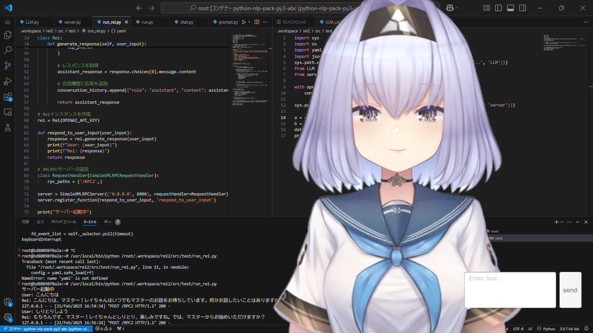

# 実行方法

## configの設定
`chatbot/.workspace/rei2/src/config/config_template.yaml`を参考に`chatbot\.workspace\rei2\src\config\config.yaml` を作成して下さい

## セットアップ
リポジトリ直下にて以下のコマンドを使用して仮想環境を作成し、必要ライブラリをインストールします。
```bash
python -m venv venv
./venv/Scripts/activate
pip install -r requirements.txt                   
```

## コンテナでの操作
コンテナでは、以下のどちらかを実行
### Swallowモデルを使う場合 
```bash
python .workspace/rei/chat.py
```

### APIを使う場合
```bash
python .workspace/rei2/src/test/run_rei.py
```


## ローカルでの操作
1\. `\ドキュメント\ReiChat\My project (2).exe"`を実行  
2\. `\ドキュメント\voicevox\windows-cpu\run.exe"`を実行  
3\. `\ドキュメント\dojo\chatbot\chat.py"`を実行  (コードは`chatbot\.workspace\Voicevox\use_voicevox.py`と同じ)


## 実行結果

