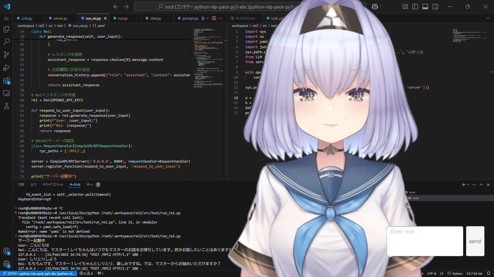

# 実行方法
## コンテナでの操作
コンテナでは、以下のどちらかを実行
### Swallowモデルを使う場合 
```bash
python .workspace/rei/chat.py
```

### APIを使う場合
```bash
python .workspace/rei2/src/test/run_rei.py
```


## ローカルでの操作
1\. `\ドキュメント\ReiChat\My project (2).exe"`を実行  
2\. `\ドキュメント\voicevox\windows-cpu\run.exe"`を実行  
3\. `\ドキュメント\dojo\chatbot\chat.py"`を実行  


## 実行結果

